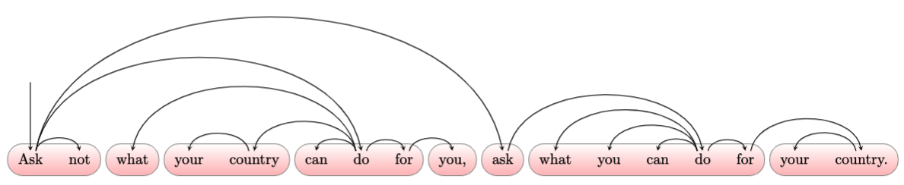

# The distribution of dependency distances

## Abstract
The syntactic structure of a sentence can be represented as a graph where vertices are words and edges indicate syntactic dependencies between them. In this setting, the distance between two syntactically linked words can be defined as the difference between their positions.
Here we want to contribute to the characterization of the actual distribution of syntactic dependency distances, and unveil its relationship with short-term memory limitations. We propose a new double-exponential model in which the decay in probability is allowed to change after a break-point. This transition could mirror the transition from the processing of words chunks to higher-level structures. We find that a two-regime model -- where the first regime follows either an exponential or a power-law decay -- is the most likely one in all 20 languages we considered, independently of sentence length and annotation style. Moreover, the break-point is fairly stable across languages and averages values of 4-5 words, suggesting that the amount of words that can be simultaneously processed abstracts from the specific language to a high degree. Finally, we give an account of the relation between the best estimated model and the closeness of syntactic dependencies, as measured by a recently introduced optimality score.

## Information
This is the repository for the Master's Thesis 'The distribution of dependency distances', the final work for the Master's course in Data Science and Economics at University of Milan. The Thesis has been written at Universitat Politécnica de Catalunya during a period of study abroad, under the supervision of Professor Ramon Ferrer-i-Cancho. The supervisor at University of Milan is Professor Nicolò Cesa-Bianchi.

## Structure
The repository contains the following folders:
  - collections: raw head-vector files for PUD and PSUD.
  - data: csv files with processed version of the collections (subfolder 'real'), and artificial random samples (subfolder 'artificial').
  - figures: pdf figures included in the work.
  - graphs: tex files with examples of dependency trees.
  - latex outputs: tex files with tables included in the work.
  - results: csv files with results of model selection.
  

  

